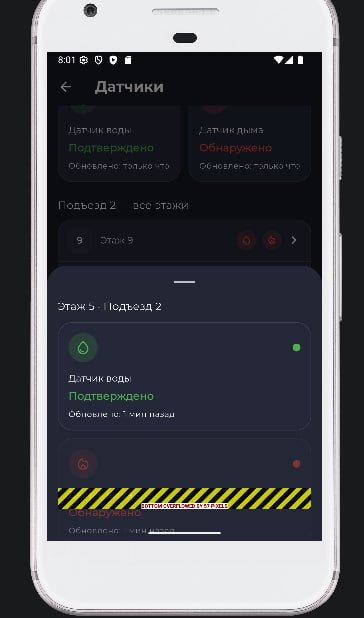
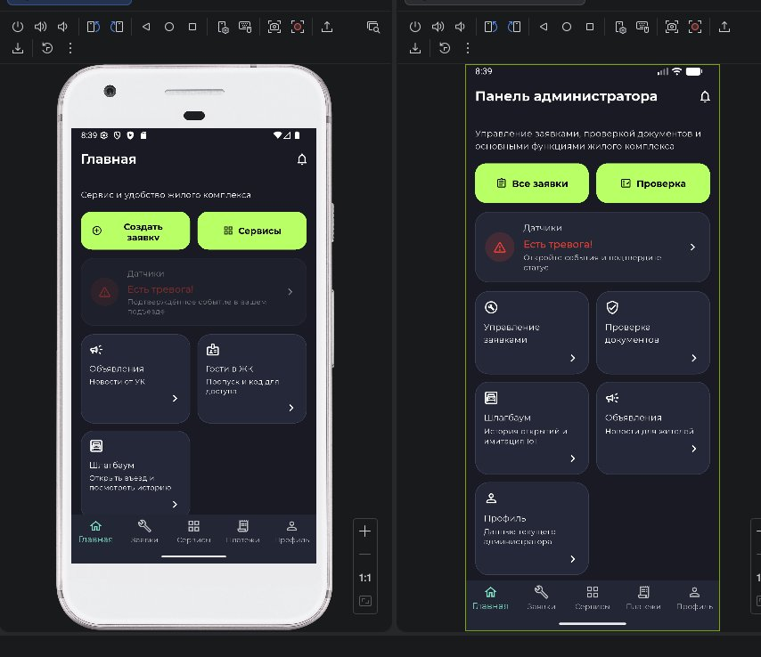
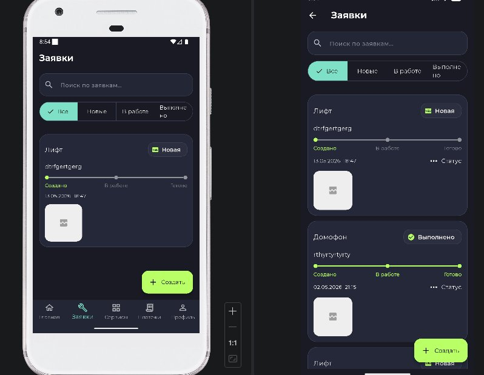

# Отчёт об ошибках — SmartApp

## Баг 1 — RenderFlex overflow на странице датчиков

**Страница:** `sensors_page.dart` (строка 198)

**Описание:**  
На странице датчиков при отображении списка возникает ошибка рендеринга — содержимое `Column` выходит за границы контейнера на 57 пикселей снизу. В UI это проявляется жёлто-чёрной полосой внизу экрана.

**Ошибка в консоли:**
```
A RenderFlex overflowed by 57 pixels on the bottom.
The relevant error-causing widget was: Column
file: lib/pages/sensors_page.dart:198:20
```

**Скриншот:**  


---

## Баг 2 — Баннер датчиков горит красным при отсутствии тревог

**Страница:** Главная (жилец и админ)

**Описание:**  
На главном экране баннер «Датчики» отображается в красном/тревожном состоянии даже когда активных тревог нет. Проблема воспроизводится как у жителя, так и у администратора.

**Скриншот:**  


---

## Баг 3 — Фото не отображается в заявках

**Страница:** Заявки (жилец и админ)

**Описание:**  
В карточках заявок вместо прикреплённого фото отображается серая иконка-заглушка. Проблема воспроизводится у обеих ролей — и у жителя, и у администратора.

**Скриншот:**  

